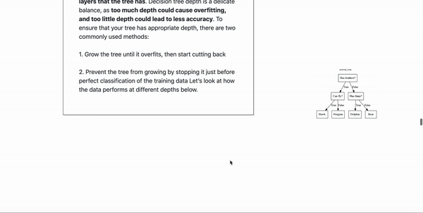

# CMU Interactive Data Science Final Project

* **Online URL**: https://cmu-ids-2020.github.io/fp-classification_clarification/
* **Team members**:
  * Contact person: Juliette Wong (jnwong@andrew.cmu.edu)
  * Christian Deverall (cdeveral@andrew.cmu.edu)
  * Nathan Jen (njen@andrew.cmu.edu)
  * Laura Howard (lmhoward@andrew.cmu.edu)
* **Track**: Narrative
* **Link to Writeup**
  * https://docs.google.com/document/d/1BcS38FISWubnDMzgZH8WvUXMPNu6EFGlB9GF6Lm1b5M/edit
  * https://github.com/CMU-IDS-2020/fp-classification_clarification/blob/main/Report.md
* **Link to Video**
  * https://drive.google.com/file/d/1DVViARjZJs3MUZ26VO4On_xhRMmVCaHW/view?usp=sharing


## Abstract

The goal of our project is to explain classification algorithms to readers without prior knowledge in machine learning. Our solution is to create an interactive “scrollytelling” narrative. Our narrative is centered around a case study where readers see whether education and age have an impact on income level. The narrative first introduces the dataset, allowing users to understand the basis of our models through exploratory data analysis. Next, we cover some of the inherent problems common to all machine learning problems, such as the concept of training data and overfitting. Finally, we introduce the three classification algorithms, K-Nearest Neighbors, Decision Trees, and Logistic Regression. In these sections, we include interactive visualizations that allow the user to see how changing the hyperparameters can affect the results of the model. We hope that by reading and interacting with the article, readers will understand at a high-level how these different classifications work, and that there are multiple ways to achieve similar outcomes with machine learning. 

## Work distribution

### Nathan
I was primarily responsible for the styling of our web application, which meant writing custom CSS and bolding text. Additionally, since I am the only team member with JavaScript experience, I had to build out the custom React components for our application as well as implement a lot of our app's functionality. Finally, I was responsible for figuring out how to deploy our Idyll application to GitHub pages. 

## Project Process
Our project progressed relatively slowly in the initial stage as we had to gain familiarity with the Idyll markup language. The major challenge here was integrating Idyll with D3 and vega-lite components, which contained limited documentation. For datasets, we initially used the Iris flower dataset, however we later settled on the 1994 Census dataset to perform income prediction. We created a plan for the 3 algorithms we wanted to cover and the technologies we would use to visualize them. This allowed us to simultaneously work on the text contents and visualizations. In order to promote seamless transitions from text to visualizations, we changed the text contents iteratively as we created updated versions of our visualizations. In the end stage of the project, we focused on making stylistic adjustments in Idyll based on group feedback and adding decoration to our visualizations.

## Deliverables

### Proposal

- [x] The URL at the top of this readme needs to point to your application online. It should also list the names of the team members.
- [x] A completed proposal. The contact should submit it as a PDF on Canvas.

### Design review

- [x] Develop a prototype of your project.
- [x] Create a 5 minute video to demonstrate your project and lists any question you have for the course staff. The contact should submit the video on Canvas.

### Final deliverables

- [x] All code for the project should be in the repo.
- [x] A 5 minute video demonstration.
- [x] Update Readme according to Canvas instructions.
- [x] A detailed project report. The contact should submit the video and report as a PDF on Canvas.

## Running the Project

* Install npm ([follow this link][https://www.npmjs.com/get-npm])
* Install idyll
  * npm install -g idyll
* Install dependencies for idyll
  * npm i 
* Use es5 version for vega-lite and vega-embed (must be manually done)
  * For vega-lite: Go to node_modules/vega-lite, copy vega-lite.js from build-es5 directory to build directory
  * For vega-embed: Go to node_modules/vega-embed, copy vega-embed.js from build-es5 directory to build directory
* Run the project
  * idyll
